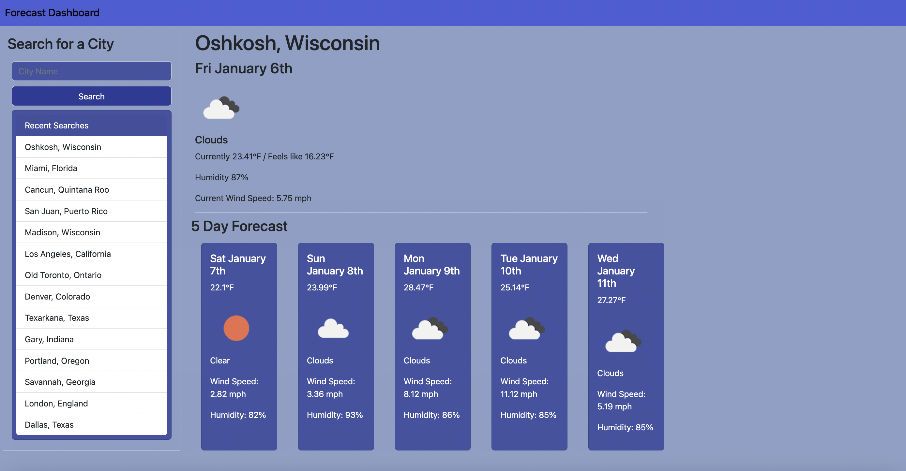

# Weather Dashboard

## Description
This weather dashboard shows curent and future weather informataion along with a forecast of a city the user searches for. It includes information on current conditions and a five day forecast using the OpenWeatherMap API. It saves recent searches below the search bar and a user can click a previous search to bring up that city's weather information. When a user clicks a previous search, it moves that item to the top of the recent search history.

## Screenshot

## Links

[Github Repo](https://github.com/kevinkraiss/forecast-dashboard)

[Live Application](https://kevinkraiss.github.io/forecast-dashboard/)